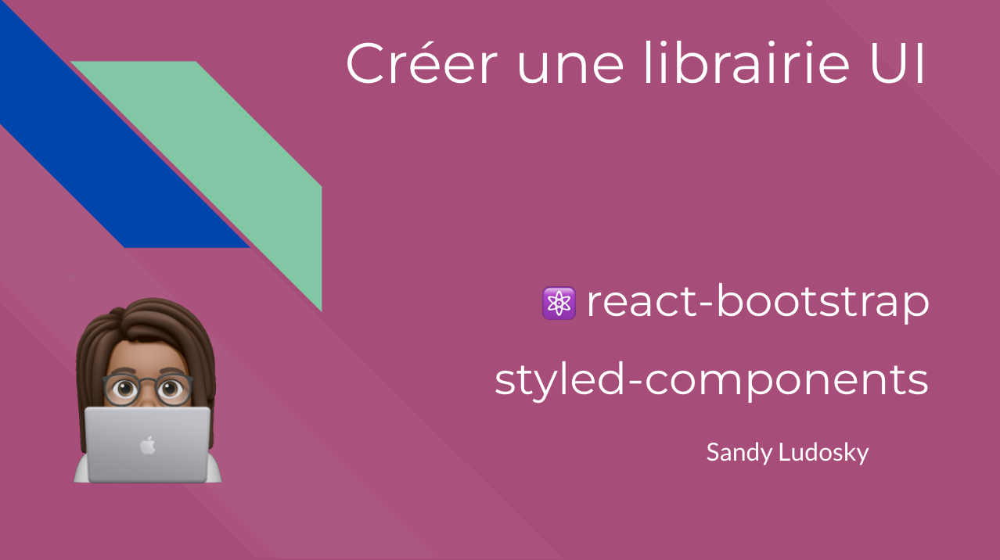

# Créer une librairie UI (front) avec styled-components et react-bootstrap

*Dans ce webinar, on découvre les librairies **styled-components** et **react-bootstrap** pour créer des composants de style réutilisables et flexibles* 

## Au programme :
- apprendre les solutions de CSS modernes
- écrire du CSS-in-JS
- combiner les propriétés CSS avec les expressions javascript

## les outils & ce dont vous aurez besoin : 
- un code éditeur [Visual Code Studio](https://code.visualstudio.com/) 
- une dernière version stable de [Node](https://nodejs.org/en/)
- un navigateur moderne: Chrome, Firefox ou Safari

## Pour démarrer :

`git clone [url répertoire]`

`npm install`

`npm start`